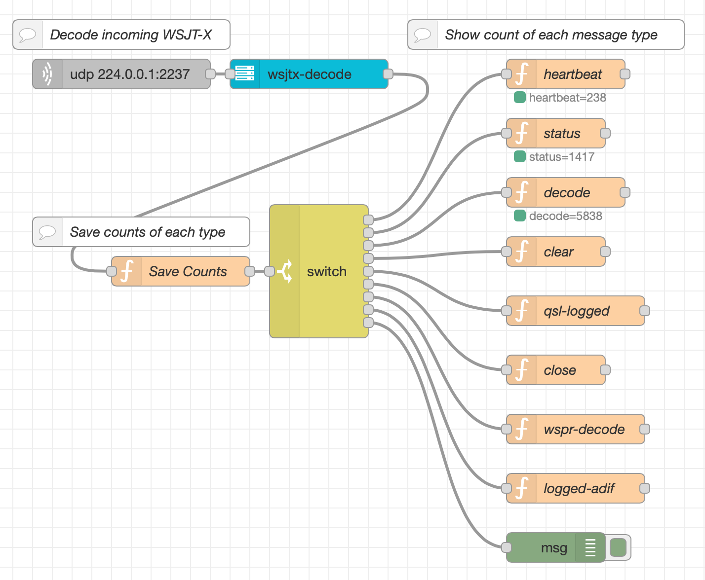

# node-red-contrib-wsjt-x

A simple node to handle the decoding of WSJT-X data in NodeRed.

To best utilize this node in your flow while still being able to use other
programs (like GridTracker) you should configure WSJT-X's Reporting, UDP Server
to send to a *multicast* address (example 224.0.0.1). Then in all the places 
you want to receive that data, configure those a multicast as well. Within 
NodeRed's `udp in` node, choose `Listen for: multicast messages` and then
configure the same multicast `group` (IP address) and port that you configured
WSJT-X with.

