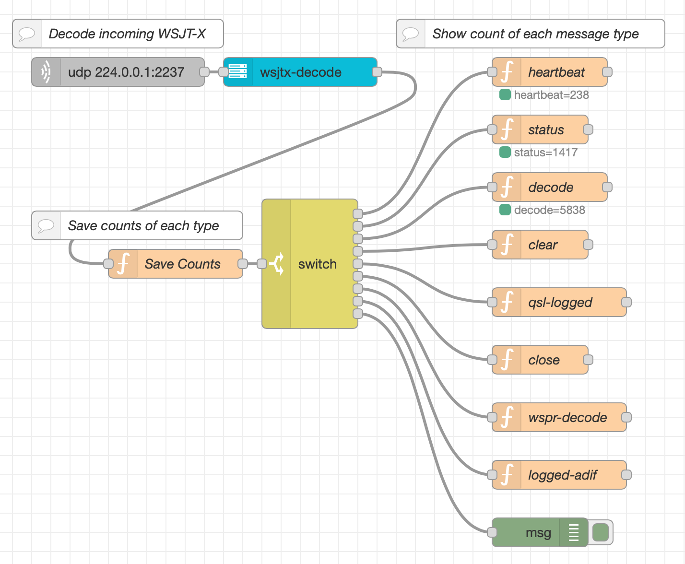

# node-red-contrib-wsjt-x

A [Node-RED](https://nodered.org) node to handle the decoding and encoding of [WSJT-X](https://www.physics.princeton.edu/pulsar/k1jt/wsjtx.html) (and [JTDX](https://www.jtdx.tech/en/)) data. WSJT-X is an amatuer (ham) radio program that enables weak-signal radio communications using a variety of specially desinged protocols (FT8, FT4, WSPR, JT8, JT4, and more). This node allows the data sent by WSJT-X to be injected into Node-RED flows for further processing and use. It also allows messages from Node-RED flows to be encoded and sent to WSJT-X.



To *best* utilize this node in your flow while still being able to use other programs (like GridTracker or your logging software) you should configure WSJT-X's Reporting: UDP Server to send to a [multicast address](https://en.wikipedia.org/wiki/Multicast_address). RFC 3171 reserves IP addresses `239.255.0.0/16` (`239.255.0.1` to `239.255.0.254`) for "IPv4 Local Scope", thus an IP in this range is a great choice. Then in all the places you want to receive that data, configure those a multicast as well. Within Node-RED's `udp in` node, choose `Listen for: multicast messages` and then configure the same multicast IP address and port that you configured WSJT-X with.

To *send* commands to WSJT-X you will need to identify the IP address and port number that WSJT-X is using to send data out. This is not the same as the address WSJT-X sends to (above). The easist method is to use a `udp in` node setup to receive data (as above) and use the `msg.ip` and `msg.port` from incoming messages. The `wsjt-x-encode` node can be used to encode messages from your flow into `buffer` objects that a `udp out` node, properly configured, can then send to WSJT-X. You will also have to configure WSJT-X to accept incoming UDP commands, look in *Settings*.

## WSJT-X Encoding

WSJT-X accepts some commands to control its operation via the same UDP address it sends out notifications. The `wsjt-x-encode` node can encode these messages from JSON objects. This will allow you to control some aspects of WSJT-X from Node-RED. See the [WSJT-X Source Code](https://sourceforge.net/p/wsjt/wsjtx/ci/master/tree/Network/NetworkMessage.hpp) for the details of how each command works and their parameters. Set the `topic` of the message to the WSJT-X command.

A summary of the commands (topics) that can be encoded are as follows:

- **clear**: `{"window":2}`
- **heartbeat**: `{"max_schema_number":3,"version":"2.6.1","revision":""}`
- **reply** (untested): `{}`
- **halt_tx**: `{"auto_tx_only":false}`
- **close**: `{}`
- **replay**: `{}`
- **free_text**: `{"text": "sample", "send": false}` (text can be `null` to change `send` only)
- **location**: (does not seem to work) `{"location": "FN43rq"}`
- **logged_adif**: `{"adif_text": "...adif XML-like stuff..."}`,
- **switch_configuration**: `{"configuration_name":"IC-705"}`
- **highlight_callsign**: `{"callsign": "...", "background": "#ff00ff", "foreground": "000000", "highlight_last" false}` (use `null` fields for invalid color, which clears highlight)
- **configure**:
```
    {
        "mode":"FT8",                   // null or emptyis no change
        "frequency_tolerance": null,    // null is no change 
        "sub_mode": "",                 // null or emptyis no change
        "fast_mode": true, 
        "tr_period": null,              // null is no change
        "rx_df": null,                  // null is no change
        "dx_call": null,                // null or emptyis no change 
        "dx_grid": null,                // null or emptyis no change
        "generate_messages": true
    }
```
